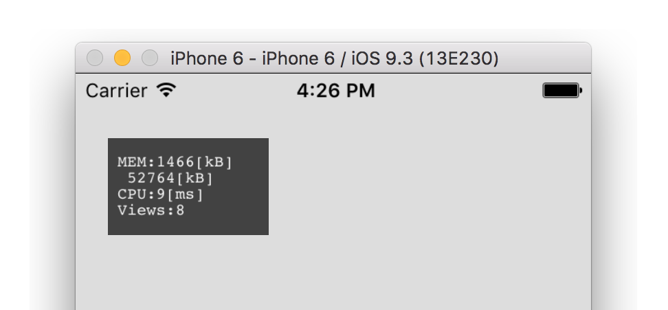
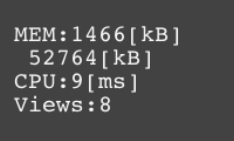
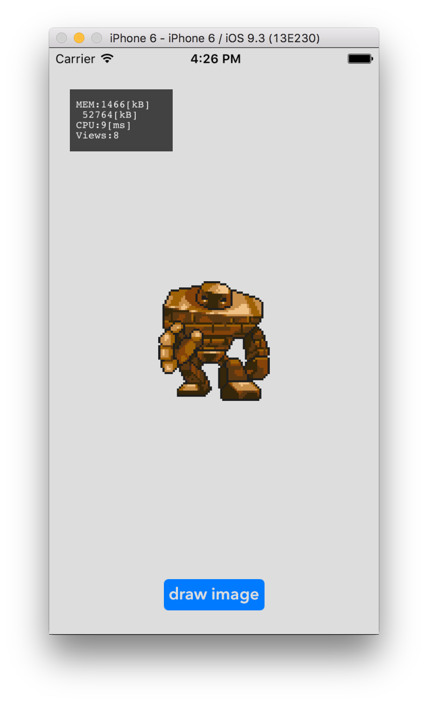

##What's Stats

Stats **displays load statuses** such as the memory usage, the CPU load, and the number of subviews **in-app**, and **in realtime**.



##How to use

**Just add on your view**!

1. Add Stats.h, Stats.m to your project
2. As with UILabel, add wherever you like.

```objc
self.stats = [[Stats alloc] initWithFrame:CGRectMake(20, 40, 100.0, 60.0)];
[self.window addSubview:self.stats];
```

##Parameters and the units



From top to bottom,

- The variation of memory usage [kB]
- The total memory usage [kB]
- The variation of CPU time [msec]
- The number of UIView subclasses


##Demo

A full Xcode demo project is included in the "StatsDemo" directory.




##Articles

- [English](http://d.hatena.ne.jp/shu223/20111118/1321576538)
- [Japanese](http://d.hatena.ne.jp/shu223/20110428/1303930059)
